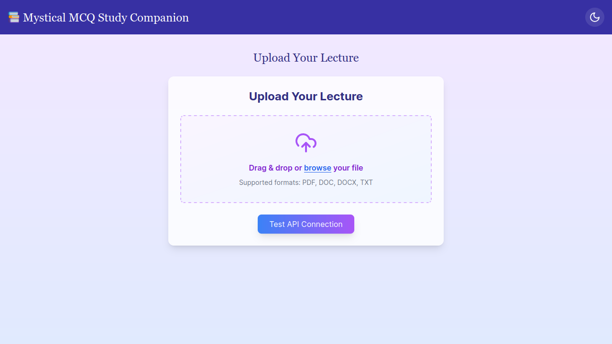
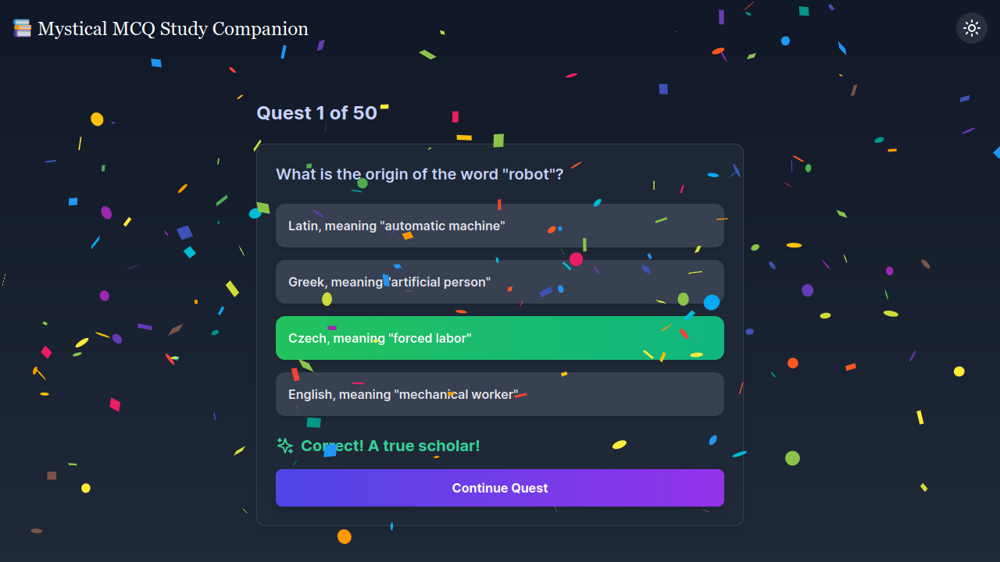
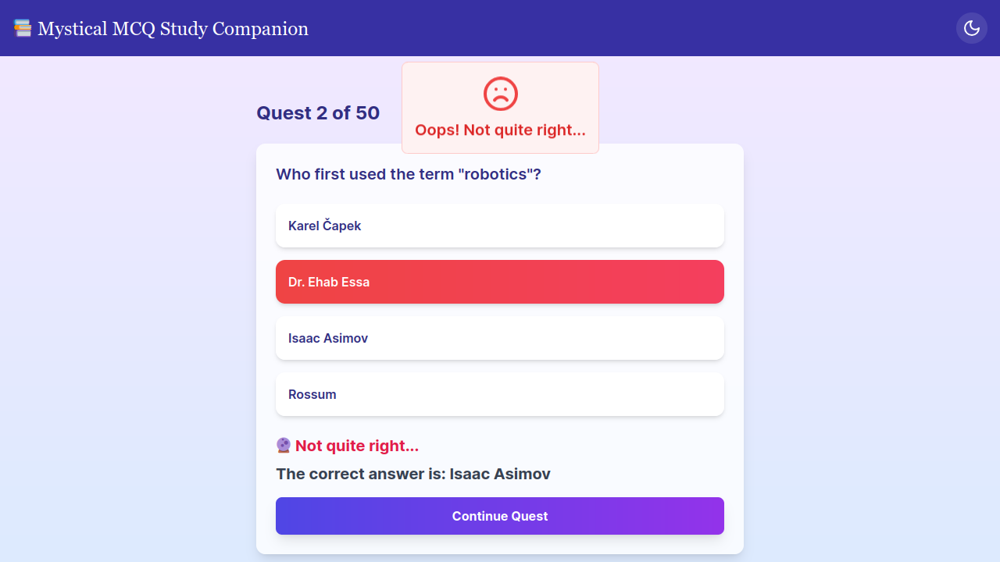
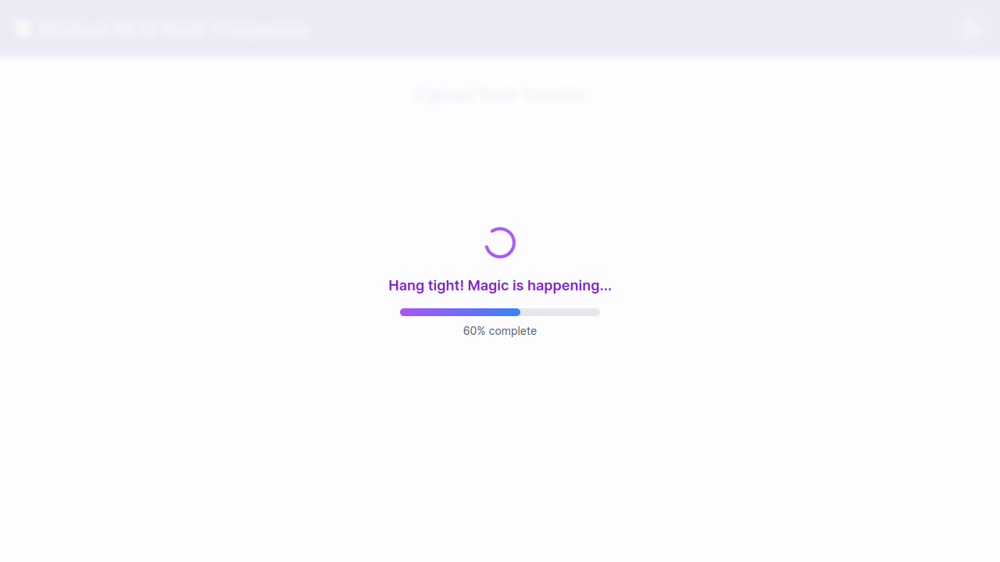

# Mystical MCQ Study Companion

 <!-- Replace with your first image -->

The **Mystical MCQ Study Companion** is a web application designed to help students generate multiple-choice questions (MCQs) from lecture materials (PDFs, text files, etc.) and test their knowledge through interactive quizzes. The app uses the **Gemini API** to generate questions and provides a modern, user-friendly interface with dark mode support.

---

## Features

- **Upload Lecture Materials**: Upload PDFs, text files, or other supported formats to generate MCQs.
- **Interactive Quiz**: Answer generated questions and get instant feedback.
- **Dark Mode**: Toggle between light and dark themes for comfortable studying.
- **Dynamic Feedback**: Fun reactions for correct and incorrect answers (confetti for correct answers, sad face for wrong answers).
- **Progress Tracking**: See your progress as you complete questions.

---

## Screenshots







---

## How to Use

1. **Upload a File**:

   - Click the "Upload Your Lecture" button and select a file (PDF, text, etc.).
   - The app will process the file and generate MCQs.

2. **Take the Quiz**:

   - Answer the questions presented in the quiz interface.
   - Get instant feedback with fun animations and reactions.

3. **Continue or Restart**:
   - Click "Continue Quest" to move to the next question.
   - If you finish all questions, you can restart the quiz.

---

## Installation

To run this project locally, follow these steps:

1. **Clone the Repository**:

   ```bash
   git clone https://github.com/your-username/mystical-mcq-study-companion.git
   cd mystical-mcq-study-companion
   ```

2. **Install Dependencies**:

   ```bash
   npm install
   ```

3. **Set Up Environment Variables**:

   - Create a `.env` file in the root directory.
   - Add your Gemini API key:
     ```plaintext
     VITE_GEMINI_API_KEY=your_api_key_here
     ```

4. **Run the Project**:

   ```bash
   npm run dev
   ```

5. **Open in Browser**:
   - Visit `http://localhost:5173` (or the port specified in the terminal) to use the app.

---

## Technologies Used

- **Frontend**: React, Tailwind CSS, Vite
- **API**: Gemini API (for MCQ generation)
- **Icons**: Lucide React
- **Animations**: React Confetti

---

## Contributing

Contributions are welcome! If you'd like to contribute to this project, please follow these steps:

1. Fork the repository.
2. Create a new branch (`git checkout -b feature/YourFeatureName`).
3. Commit your changes (`git commit -m 'Add some feature'`).
4. Push to the branch (`git push origin feature/YourFeatureName`).
5. Open a pull request.

---

## License

This project is licensed under the MIT License. See the [LICENSE](LICENSE) file for details.

---

## Acknowledgments

- Thanks to the **Gemini API** for enabling MCQ generation.
- Special thanks to the developers of **React**, **Tailwind CSS**, and **Vite** for making this project possible.

---

Enjoy studying with the **Mystical MCQ Study Companion**! 📚✨
